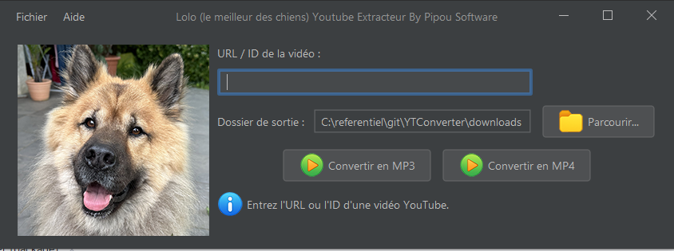

# 🐶 Lolo Youtube Extracteur

**Lolo Youtube Extracteur** est une application Java Swing simple et conviviale pour télécharger et convertir des vidéos YouTube en MP3 ou MP4, avec une interface graphique personnalisée et des icônes mignonnes de Lolo, le chien ninja développeur 🐾.

Développé par **Pipou Software**, avec ❤️, yt-dlp, ffmpeg et plein de Bonies™.

## 🎬 Fonctionnalités

- Télécharge des vidéos YouTube via leur URL ou ID.
- Convertit les vidéos en :
    - 🎵 MP3 (audio uniquement)
    - 🎥 MP4 (audio + vidéo)
- Interface graphique avec :
    - Barre de progression
    - Choix du dossier de sortie
    - Messages d’état visuels
- Intégration de `yt-dlp` et `ffmpeg` en tant que binaires natifs.
- Icônes personnalisées et Look&Feel moderne avec FlatLaf.

## 🖼️ Capture d'écran



## 🚀 Prérequis

- Java 17+ (ou version compatible avec Swing et FlatLaf)
- Système Windows (les binaires `yt-dlp.exe` et `ffmpeg.exe` fournis sont pour Windows)
- Aucun autre logiciel requis : tout est embarqué dans l'application !

## 📦 Packaging du projet

- JPackage en mode installation toute propre :
```
jpackage ^
--type exe ^
--name YTConverter ^
--input target/ ^
--main-jar YTConverter-1.0-SNAPSHOT.jar ^
--main-class fr.synapse.YTConverter ^
--icon icon.ico ^
--win-shortcut ^
--win-menu ^
--win-dir-chooser ^
--app-version 1.0 ^
--java-options "-Dfile.encoding=UTF-8"
```

- JPackage en mode repertoire  :
```
jpackage ^
--type app-image ^
--name YTConverter ^
--input target/ ^
--main-jar YTConverter-1.0-SNAPSHOT-jar-with-dependencies.jar ^
--main-class fr.synapse.YTConverter ^
--java-options "-Dfile.encoding=UTF-8" ^
--icon C:/referentiel/projets/YTConverter/lolo.ico ^
--resource-dir src/main/resources/ ^
--runtime-image C:/workspace/env/java/graalvm-jdk-21.0.7+8.1
```